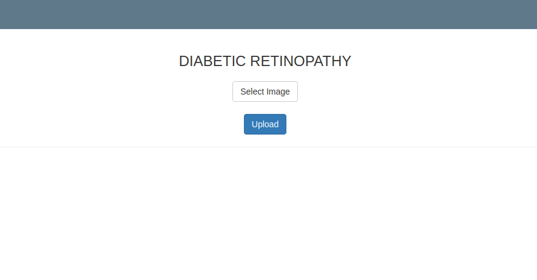
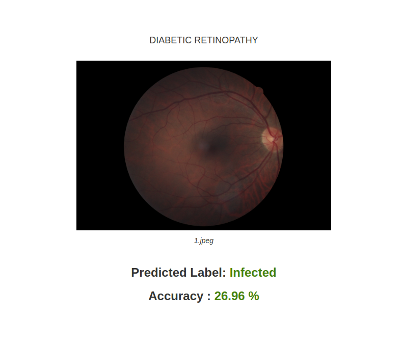

# Diabetic Retinopathy Detection using Deep Learning

## Overview

Millions of people suffer from Diabetic retinopathy, the leading cause of blindness among working aged adults. Aravind Eye Hospital in India hopes to detect and prevent this disease among people living in rural areas where medical screening is difficult to conduct. Currently, the technicians travel to these rural areas to capture images and then rely on highly trained doctors to review the images and provide diagnosis.
The goal here is to scale their efforts through technology; to gain the ability to automatically screen images for disease and provide information on how severe the condition may be. We shall be achieving this by building a Convolutional neural network model that can automatically look at a patient's eye image and estimate the severity of blindness in the patient. This process of automation can reduce a lot of time thereby screening the process of treating diabetic retinopathy at a large scale.

### Algortihms Used

1. Convolutional Neural Network
	
Accuracy We got 73%

### Deployment Images
	HomePage

	
	Result	

### Packages and Tools Required:
	Python 3.8
	Flask
	Tensorflow
	Keras
	OpenCV
	
## Built with
* Flask
* JavaScript
* CSS
* HTML

## Instructions
1. Install [Python](https://www.python.org/) (v.3.8 is recommended).
1. Clone or download this repository.
1. Using a command prompt/terminal, go the project folder: `/Deploy/`
1. Install the dependencies: 
`pip install -r requirements.txt`
1. Run the server:
`FLASK_APP=app.py FLASK_DEBUG=1 flask run  [port number, default=5000]`
1. Using a web browser, go to `http://127.0.0.1:[port]/`

